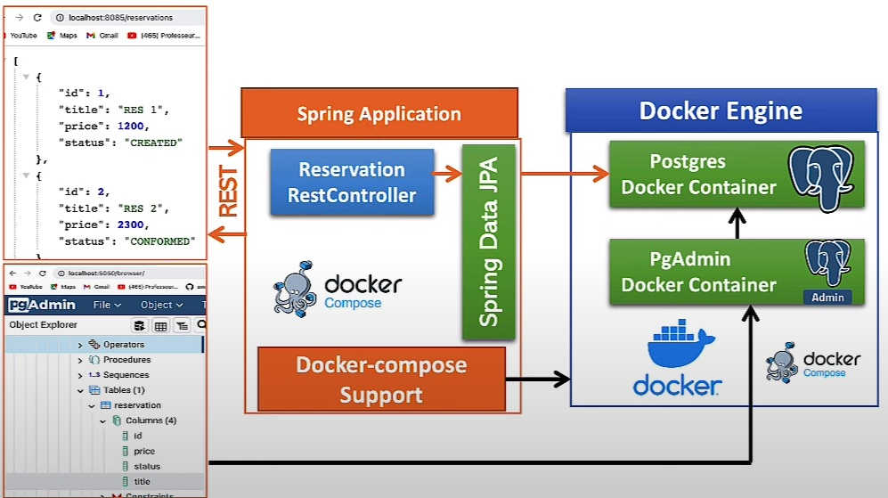
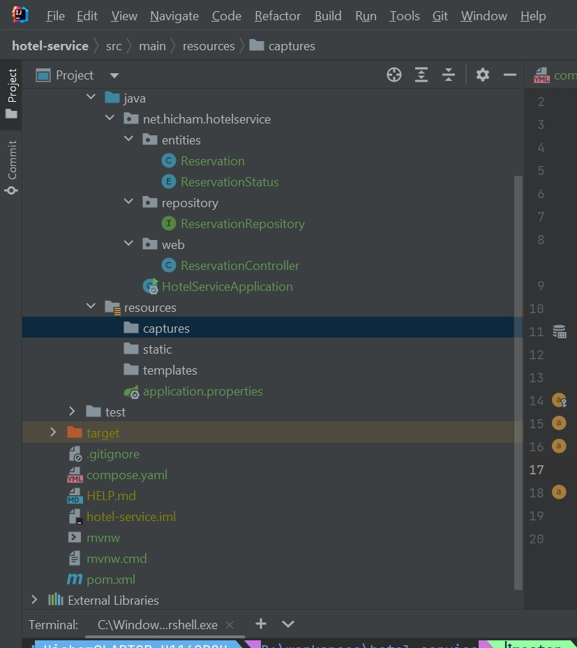
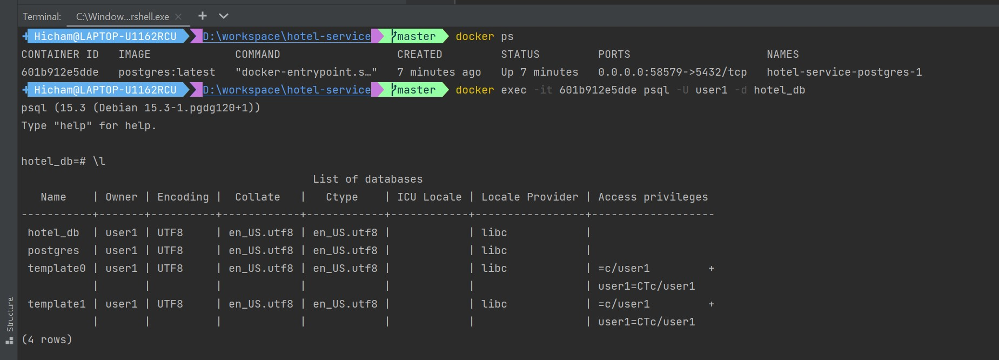
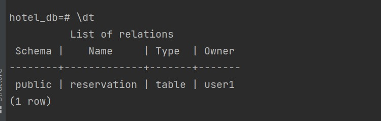
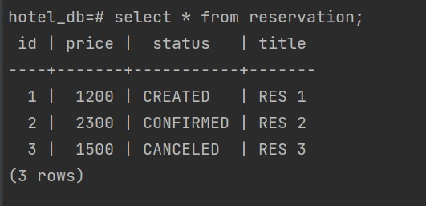
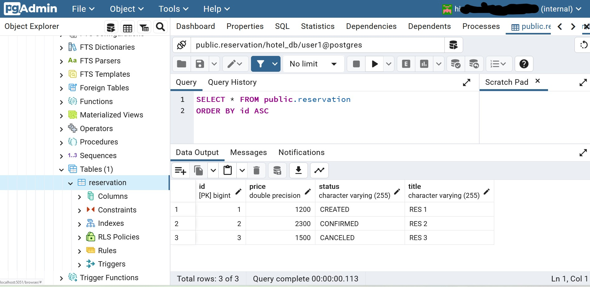

<h2>Spring Docker Compose support</h2>
  

<h3>Arborescence du projet</h3>

<h3>Exécution du contenair hotel-service-postgres-1:</h3>
 

<h4>Liste de tables dans la base hotel_db: </h4>

<h4>Afficher la table reservation: </h4>

<h3>Visualiser la base de données "hotel_db dans PgAdmin</h3>
 

